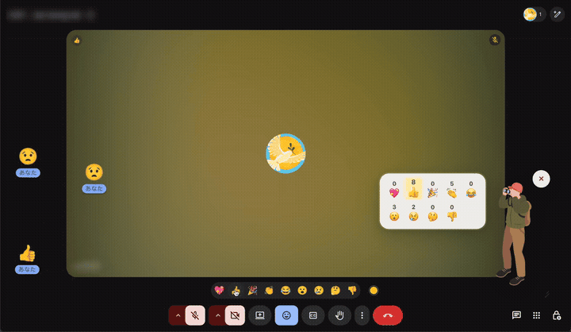
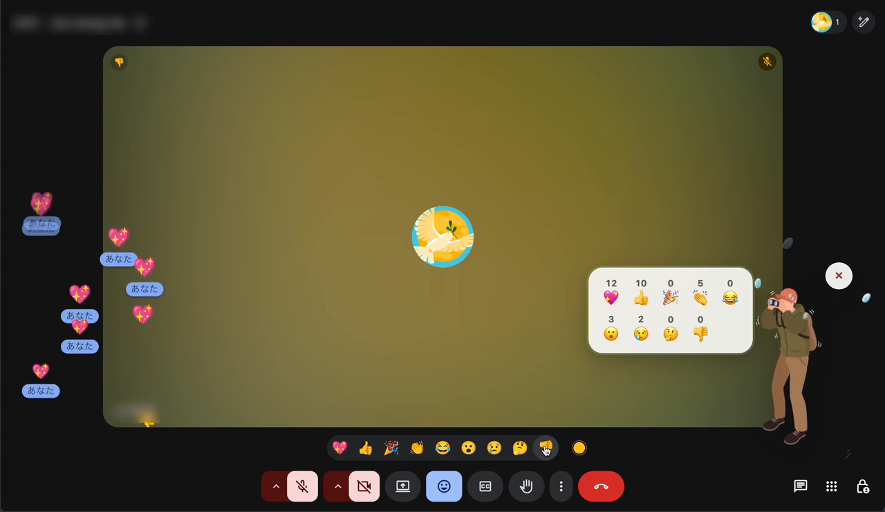
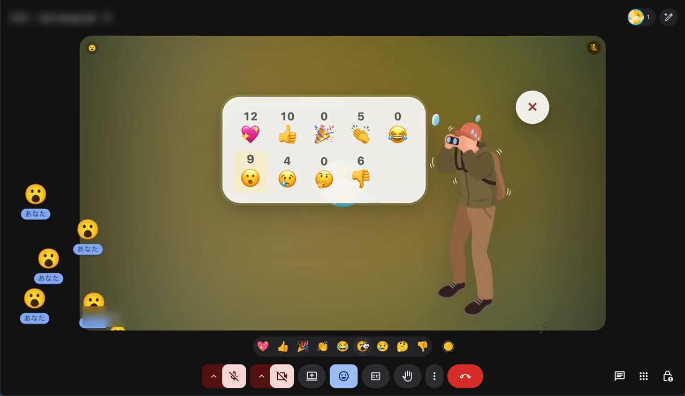

# Meet リアクション野鳥の会 🔭

Google Meet の画面に流れてくるリアクション絵文字を、双眼鏡を構えた観察員が種類別にカウントする Chrome 拡張機能です。講義やワークショップで「いまの気持ちをリアクションで教えてください」と呼びかけたとき、流れて消えていく絵文字を数えて集計できます。

主催者(集計したい人)の Chrome にだけインストールすれば動きます。参加者側の準備は不要です。

## 実行例

リアクションが流れてくると、観察員の隣のパネルに種類別の累計が表示されます。

短時間にたくさん流れてくると、観察員が慌てて汗を飛ばしながら数えます。パネルは好きな位置・大きさに調整できます。

▶ **動画で見る**: [docs/demo.mp4](docs/demo.mp4)(クリックすると GitHub 上で再生できます)

## インストール

1. このリポジトリをダウンロード(`Code` → `Download ZIP` を展開、または `git clone`)
2. Chrome で `chrome://extensions` を開く
3. 右上の「デベロッパー モード」をオン
4. 「パッケージ化されていない拡張機能を読み込む」を押す
5. このフォルダを選ぶ
6. Google Meet を開き直す

## 使い方

| 操作 | 方法 |
| --- | --- |
| カウント開始 | Meet 画面右上の 🔭(双眼鏡)ボタンを押す。表示と同時にカウントが始まります |
| カウント終了・リセット | パネル右上の `×` を押す。非表示と同時に停止し、カウントもリセットされます |
| 移動 | パネルや観察員の余白をドラッグ。🔭 / `×` ボタン自体も、掴んで動かせばウィジェットごと移動できます(動かさずに離せば開閉) |
| サイズ変更 | パネル右下の斜線ハンドルをドラッグ(60〜160%) |

🔭 ボタンは、閉じても `×` があった場所(パネル右上)にそのまま残るので、開閉で位置がずれません。

## 数え方の仕組み

「画面に流れてきたアイコンを 1 件として数える」ことを最優先に設計しています。

- **動くものだけを数える** — 出現位置から一定以上動いた絵文字要素だけをカウントします。送信者タイル上の静止バッジのような付随表示は数えません。
- **1 要素 = 1 カウント** — 一度数えた DOM 要素は二度と数えません。Meet が内部で作る重複コピー(読み上げ用テキスト、名前チップ、同座標で同じ動きをする複製)は 1 件に統合します。
- **近接した別リアクションは別カウント** — ほぼ同じ場所から同時に湧いた複数のリアクションも、動きがずれた時点で個別に数えます。
- **読み上げ通知との突き合わせ** — Meet がスクリーンリーダー向けに出す通知と目視カウントを照合し、目視で拾えなかった分だけを補完します。Meet の画面構造が変わっても数え続けられる保険です。

## 大切な仕様・プライバシー

- 数えるのは「人数」ではなく「画面に表示された回数」です。
- 参加者の顔・名前・音声は取得も保存もしません。外部への通信も一切ありません。
- 動作するのは `meet.google.com` のページ内だけです。
- Google Meet の画面構造が変わると、検出調整が必要になる場合があります。
- 同じ絵文字が極端に短時間へ集中した場合など、多少の誤差が出ることがあります。

## 対象リアクション

💖 👍 🎉 👏 😂 😮 😢 🤔 👎

(肌の色のバリエーションや類似絵文字は同じ種類に集約して数えます)

## 講義での案内例

> いまから10秒間、今の気持ちに近いリアクションを1人1回だけ押してください。画面に現れた絵文字だけを、AIで作った「野鳥の会」が数えます。顔や名前は見ていません。

## 開発について

このプロジェクトは [Claude Code](https://claude.com/claude-code) を使って実装しました。コミット履歴に実装の過程が残っています。

## 成果物の確認方法

- 上記の「実行例」の GIF・画像・動画([docs/demo.mp4](docs/demo.mp4))で、実際に Google Meet 上でリアクションを検出・カウントしている様子を確認できます。
- 実際に動かして確認したい場合は、上記「インストール」の手順で Chrome に読み込み、Google Meet の会議画面でリアクションボタンを押してみてください。
